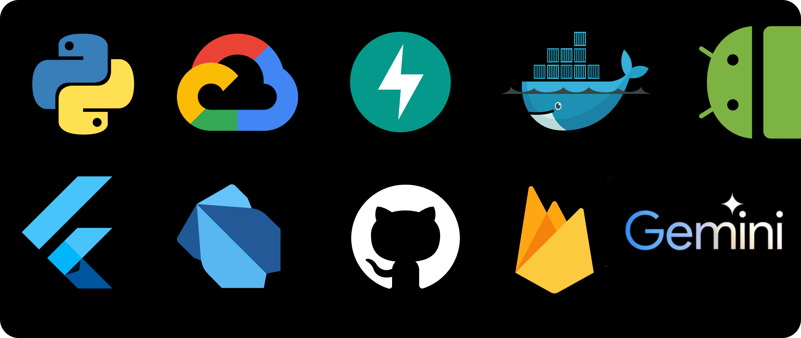

Penny is a cutting-edge personal finance app designed to empower users with financial knowledge and tools, all for free. Built using Flutter for a smooth cross-platform experience, Penny harnesses the power of Gemini AI to deliver personalized insights and assistance.

<h2>FEATURES</h2>

<table>
  <thead>
    <tr>
      <th>Feature</th>
      <th>Description</th>
      <th>Key Benefits</th>
    </tr>
  </thead>
  <tbody>
    <tr>
      <td>Course Page</td>
      <td>Learn budgeting basics to advanced investing, all personalized with AI-powered lessons. Master finance at your pace, with content that evolves with you, and enjoy the convenience of Text-to-Speech (TTS) technology, making learning accessible anytime, anywhere.</td>
      <td>
        <ul>
          <li>Personalized AI-powered lessons</li>
          <li>Learn at your own pace</li>
          <li>Text-to-Speech technology</li>
        </ul>
      </td>
      <td> </td>
    </tr>
    <tr>
      <td>Chatbot</td>
      <td>Penny's RAG-powered Chatbot, built on Gemini's natural language processing, is your 24/7 financial advisor. From clarifying course content to providing real-world financial advice, get instant, accurate answers tailored to your unique situation.</td>
      <td>
        <ul>
          <li>24/7 financial advice</li>
          <li>Instant, accurate answers</li>
          <li>Tailored to your situation</li>
        </ul>
      </td>
    </tr>
    <tr>
      <td>Practice</td>
      <td>Penny's Practice section generates real-time, interactive questions using the Gemini API. These tailored challenges reinforce your learning, ensuring you're not just memorizing facts, but truly understanding financial concepts.</td>
      <td>
        <ul>
          <li>Real-time, interactive questions</li>
          <li>Reinforces learning</li>
          <li>Ensures true understanding</li>
        </ul>
      </td>
    </tr>
    <tr>
      <td>Expense Tracker</td>
      <td>This handy tool allows you to keep a close eye on your income and expenses. Track your spending, set budgets, and get insights into your financial habits, so you can stay on top of your money game.</td>
      <td>
        <ul>
          <li>Track income and expenses</li>
          <li>Set budgets</li>
          <li>Get financial insights</li>
        </ul>
      </td>
    </tr>
    <tr>
      <td>Stock Emulator</td>
      <td>Ever wanted to dabble in the stock market without any risk? The Stock Emulator lets you do just that! See live stock data, invest faux money, and hone your investing skills in a risk-free environment. It's a great way to learn the ropes before diving into the real market.</td>
      <td>
        <ul>
          <li>Risk-free investing practice</li>
          <li>Live stock data</li>
          <li>Hone investing skills</li>
        </ul>
      </td>
    </tr>
    <tr>
      <td>News</td>
      <td>Stay informed with Penny's News section. Get live updates on the latest financial news, trends, and insights. Whether it's market movements, economic policies, or personal finance tips, you'll never miss a beat.</td>
      <td>
        <ul>
          <li>Live financial updates</li>
          <li>Latest trends and insights</li>
          <li>Comprehensive coverage</li>
        </ul>
      </td>
    </tr>
  </tbody>
</table>

<h2>📝 THINGS TO DO</h2>

   
<b>🐧 PREREQUISITES</b>

   <ol>
   <li><b>Flutter SDK</b></li>
   <li><b>Android Studio</b></li>
   <li><b>Python</b></li>
   <li><b>Google Cloud Platform Account</b></li>
   <li><b>Firebase</b></li>
   </ol>

   
<b>💿 STEPS</b>

   <ol>
      <li><b>Clone the Repo</b></li>
      <pre><code>git clone https://github.com/wreckage0907/Penny.git</code></pre>
      <li><b>Navigate to the project directory</b></li>
      <pre><code> cd Penny</code></pre>
      <li><b>Navigate to the backend directory and run</b></li>
      <pre><code> pip install -r requirements.txt</code></pre>
      <li><b>Navigate to the mobile directory and run </b></li>
      <pre><code> flutter pub get</code></pre>
      <li><b>Update .env in both /mobile & /backend</b></li>
      <li><b>Ensure you get the serviceAccountKeys from firebase for /backend & /mobile</b></li>
      <li><b>Run this in one terminal at the backend directory</b>
      <pre><code>python3 main.py</code></pre></li>
      <li><b>Run this in another terminal at the mobile directory</b></li>
      <pre><code>flutter run</code></pre>
   </ol>

   
🔮 Minimum Requirements

      <ul>
         <li>2GB Storage</li>
         <li>8GB RAM</li>
         <li>Intel Pentium +</li>
         <li>Windows 7+ (or) Mac OSX 8+</li>
      </ul>

<h2> 💻 TECH STACK </h2>

<h2>🦄 ACKNOWLEDGEMENT</h2>

> [!IMPORTANT]
> Special Thanks to [Anirudh](https://github.com/shotoyaar) for the UIUX Tips 

> [!NOTE]
> 🛠️ Made by [Girish Raghav](https://github.com/wreckage0907), [Chandani Parachuri](https://github.com/Chandani122),[Pavithran M](https://github.com/atPavithran),[Allen Joseph](https://github.com/terfefed) & [C R Sairam](https://github.com/crs7617) for [**Gemini API Developer Competition**](https://ai.google.dev/competition/?utm_content) 
